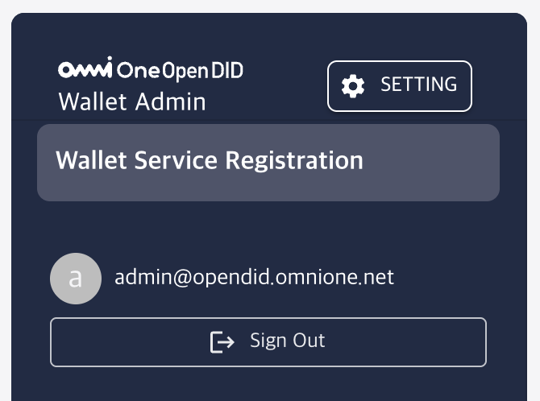
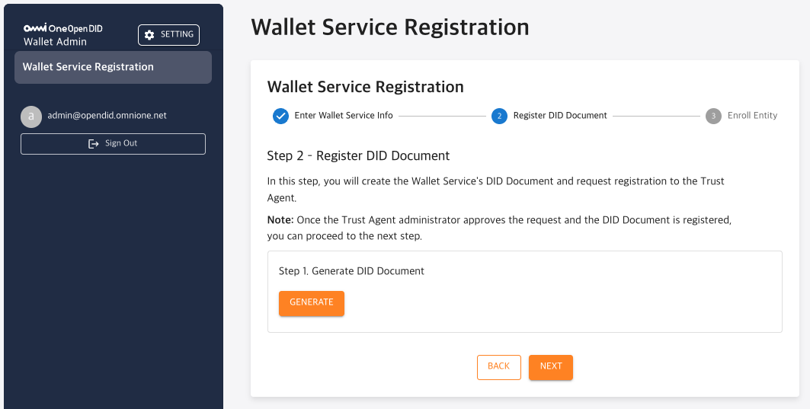
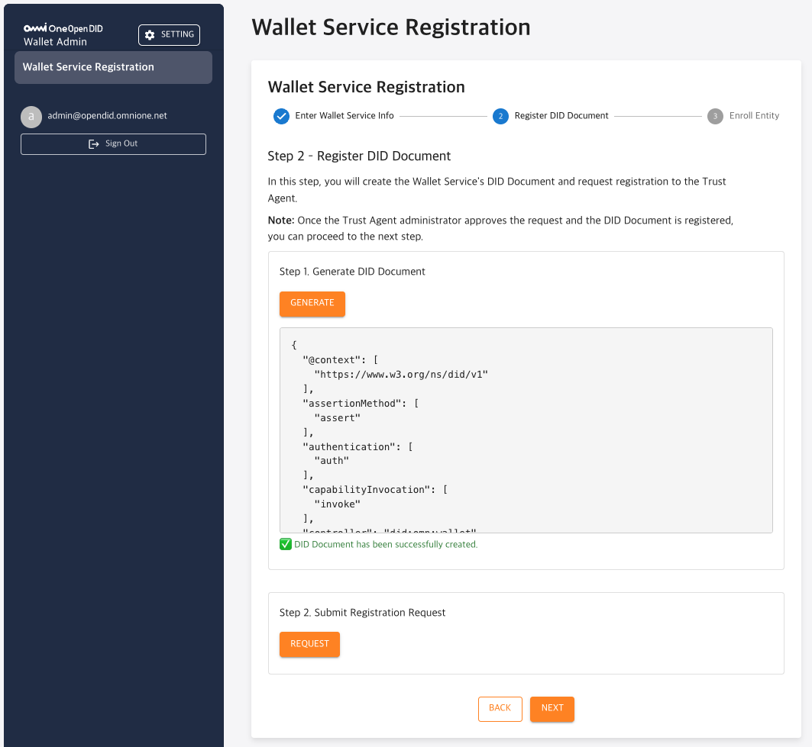
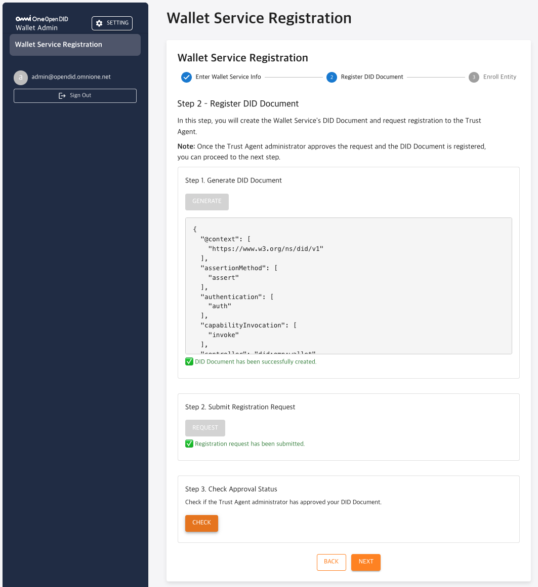
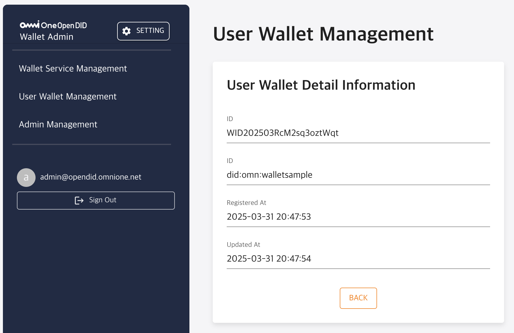
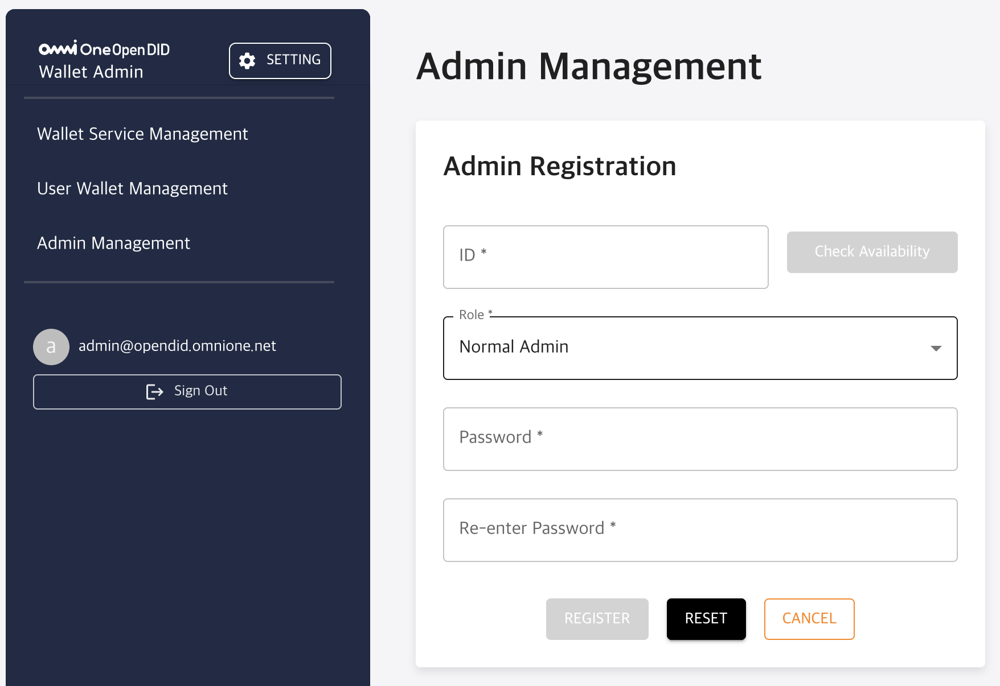

---
puppeteer:
    pdf:
        format: A4
        displayHeaderFooter: true
        landscape: false
        scale: 0.8
        margin:
            top: 1.2cm
            right: 1cm
            bottom: 1cm
            left: 1cm
    image:
        quality: 100
        fullPage: false
---

OpenDID Wallet Admin Operation Guide
==

- Date: 2025-05-29
- Version: v2.0.0

Revision History
==
| Version | Date       | Changes |
| ------- | ---------- | ------- |
| v1.0.0  | 2025-03-31 | Initial release |
| v2.0.0  | 2025-05-29 | Version update |


Table of Contents
==

- [OpenDID Wallet Admin Operation Guide](#opendid-wallet-admin-operation-guide)
- [Revision History](#revision-history)
- [Table of Contents](#table-of-contents)
- [1. Introduction](#1-introduction)
  - [1.1. Overview](#11-overview)
  - [1.2. Admin Console Definition](#12-admin-console-definition)
- [2. Basic Manual](#2-basic-manual)
  - [2.1. Login](#21-login)
  - [2.2. Main Screen Configuration](#22-main-screen-configuration)
  - [2.3. Menu Configuration](#23-menu-configuration)
    - [2.3.1. Wallet Unregistered State](#231-wallet-unregistered-state)
    - [2.3.2. Wallet Registered State](#232-wallet-registered-state)
  - [2.4. Password Change Management](#24-password-change-management)
- [3. Feature-Specific Detailed Manual](#3-feature-specific-detailed-manual)
  - [3.1. Wallet Service Registration](#31-wallet-service-registration)
    - [▸ Step 1 – Enter Wallet Service Info](#-step-1--enter-wallet-service-info)
    - [▸ Step 2 – Register DID Document](#-step-2--register-did-document)
    - [▸ Step 3 – Register Entity and Issue Certificate VC](#-step-3--register-entity-and-issue-certificate-vc)
    - [▸ Registration Completion Screen](#-registration-completion-screen)
  - [3.2. Wallet Service Management](#32-wallet-service-management)
    - [▸ Wallet Service Management](#-wallet-service-management)
  - [3.3. User Wallet Management](#33-user-wallet-management)
    - [▸ User Wallet List](#-user-wallet-list)
    - [▸ User Wallet Details](#-user-wallet-details)
  - [3.4. Admin Management](#34-admin-management)
    - [▸ Admin List View](#-admin-list-view)
    - [▸ Admin Registration](#-admin-registration)
---

# 1. Introduction

## 1.1. Overview

This document provides guidance on the installation and operation of the Open DID Wallet Admin Console.
It is organized to explain everything from basic usage to detailed manuals for each function step by step, enabling users to efficiently utilize the console.

For a comprehensive guide on OpenDID installation, please refer to the [Open DID Installation Guide].

## 1.2. Admin Console Definition

**Wallet Admin Console** is a web-based administrator tool for managing **Wallet servers** within the Open DID system.

Wallet provides user-registered Wallet management functionality.

The main items that can be configured in the Wallet Admin Console are as follows:

- **User Wallet Management**
  - View user-registered Wallets

# 2. Basic Manual

This chapter provides guidance on the basic usage of the Open DID Wallet Admin Console.

## 2.1. Login

To access the Wallet Admin Console, follow these steps:

1. Open a web browser and access the Wallet Admin Console URL.

   ```
   http://<wallet_domain>:<port>
   ```

2. Enter the administrator account email and password on the login screen.
   - Default administrator account: <admin@opendid.omnione.net>
   - Initial password: password (password change required on first login)

3. Click the 'Login' button.

> **Note**:  
> For security reasons, a password change is required on first login.

<br/>

## 2.2. Main Screen Configuration

The main screen displayed after login consists of the following elements:


| No. | Area | Description |
| --- | ---- | ----------- |
| 1 | Header Area | You can navigate to the password change screen through the `SETTING` button in the upper right corner. |
| 2 | Content Area | The title of the currently selected menu and its corresponding content are displayed. Screen content changes according to each menu. |
| 3 | Side Menu | Located on the left side of the screen, with main menu items arranged vertically. The selected menu is highlighted, and sub-menus expand when necessary. |
| 4 | User Info Area | The email address of the currently logged-in administrator and the 'Sign Out' button are displayed. |


<br/>


## 2.3. Menu Configuration

The sidebar menu of the Wallet Admin Console **differs in screen configuration depending on the Wallet registration status**.


<br/>

### 2.3.1. Wallet Unregistered State

In the initial state where the Wallet server has not yet been registered,
only the Wallet Service Registration item is displayed alone in the menu.



> Note: Once Wallet registration is completed, related functions are activated and the full menu expands.
> Details about the menu configuration after registration are explained in subsequent sections.

### 2.3.2. Wallet Registered State

Once Wallet registration is completed, all management functions are activated, and the sidebar menu is configured as follows:


| No. | Menu Name | Depth | Description |
|-----|-----------|-------|-------------|
| 1 | **Wallet Service Management** | 1 | Menu for viewing and managing basic information (DID, status, etc.) of the Wallet server. |
| 2 | **User Wallet Management** | 1 | Menu for viewing and managing user-registered Wallets. |
| 3 | **Admin Manager** | 1 | Account management menu for using the Admin Console. |

> **Note**:  
> Detailed usage instructions for each function in the above menu configuration are explained in numerical order in [Chapter 3. Feature-Specific Detailed Manual](#3-feature-specific-detailed-manual).
<br/>

## 2.4. Password Change Management

User password change can be performed through the following steps:

1. Click the 'SETTING' button in the header area.
2. Select 'Password Change' from the settings menu.
3. On the password change screen:
   - Enter current password
   - Enter new password
   - Enter new password confirmation
4. Click the 'Save' button to apply changes.

> **Note**: Password must be 8-64 characters long and include uppercase/lowercase letters, numbers, and special characters.

<br/>

# 3. Feature-Specific Detailed Manual

This chapter provides detailed usage instructions for the main functions of the Wallet Admin Console.

## 3.1. Wallet Service Registration

Wallet Service Registration is the procedure for registering the **Wallet service** as an issuing entity in the Wallet Admin Console.  
The entire registration consists of 3 steps, with input, request, and approval processes for each step to complete registration.
Once all steps are completed, the Wallet service is officially registered in the OpenDID network.

<br/>

### ▸ Step 1 – Enter Wallet Service Info


This is the step to enter the name and server URL of the Wallet service.

- **Name**: Name of the Wallet to register  
- **Wallet Service URL**: Server endpoint in the format `http://{IP}:8095/wallet`  

> **Note**  
> The Wallet service server and Admin Console use the same Base URL and are internally separated as packages.

- Click the **NEXT** button after entering required items.

<br/>

### ▸ Step 2 – Register DID Document

This is the step to generate the DID Document of the Wallet service and request registration and approval from TAS (Trust Agent Service). Follow the sequence below:

<br/>

**1. Generate DID Document**  
  
Click the `GENERATE` button to automatically generate the DID document, which is output in JSON format on the screen.  
> Completion message: ✅ DID Document has been successfully created.
> 
<br/>

**2. Submit Registration Request**  
  
Click the `REQUEST` button to send a DID document registration request to TAS.  
> Request completion message: ✅ Registration request has been submitted.


<br/>

**3. Check Approval Status**  
  
Click the `CHECK` button to confirm approval from the TAS administrator.  
> Approval completion message: ✅ Approval confirmed. You can proceed.

<br/>

**4. Screen after completing all processes**  


<br/>

### ▸ Step 3 – Register Entity and Issue Certificate VC


This is the final step to register the Wallet service as an entity in the OpenDID network and issue a **Certificate VC (VC for trust verification)**.

- Click the `REQUEST` button to register the Entity through TAS.
- Once registration is completed, click the `FINISH` button to finalize the entire registration

> **Note**  
> Certificate VC is a credential that proves trust relationships between OpenDID components.

<br/>

### ▸ Registration Completion Screen

Once registration is completed, the following completion screen is displayed.


- A "Completed" message appears, and you can click the `GO TO HOME` button to navigate to the Admin Console main screen.


## 3.2. Wallet Service Management

Wallet Service Management is a menu for registering and managing basic information of the Wallet server. As the management entity for User Wallets, Wallet must be registered with a unique DID within the system, and registration is required only once initially.  

Once Wallet is registered, it is displayed in the system as active status (`ACTIVATE`), and after registration, you can view registered information or make changes within a limited scope.

### ▸ Wallet Service Management

> **Note**  
> Currently, only Quick Register method for simple registration is supported. The formal registration procedure is scheduled to be updated in June 2025.

The Wallet Service Management screen consists of the following items.


| Item | Description |
|------|-------------|
| **DID** | A unique DID that identifies the Wallet, automatically issued by the system. |
| **Name** | The name of the Wallet. |
| **Status** | Indicates the status of the Wallet. Displayed as `ACTIVATE` when registration is completed. |
| **URL** | The basic URL of the Wallet server. |
| **Certificate URL** | URL address where you can check the Wallet's certificate. |
| **Registered At** | The initial registration date and time of the Wallet. |

- The DID Document can be viewed through the `VIEW DID DOCUMENT` button on the screen.
- Registered Wallet information cannot be deleted, and only limited modifications are possible for some items.


## 3.3. User Wallet Management

User Wallet Management is a menu for viewing and managing user-registered Wallets. 


### ▸ User Wallet List

The User Wallet list screen allows you to view registered Wallets.


| Item | Description |
|------|-------------|
| **ID** | A unique identifier for identifying the Wallet. Click to navigate to the detail screen. |
| **DID** | The unique DID of the Wallet. |
| **Registered At** | The date and time when the Wallet was registered. |
| **Updated At** | The date and time when the Wallet was updated. |


### ▸ User Wallet Details

Click on the ID in the User Wallet list to view detailed information.



| Item | Description |
|------|-------------|
| **ID** | A unique identifier for identifying the Wallet. Click to navigate to the detail screen. |
| **DID** | The unique DID of the Wallet. |
| **Registered At** | The date and time when the Wallet was registered. |
| **Updated At** | The date and time when the Wallet was updated. |


## 3.4. Admin Management

The `Admin Management` menu is a function for managing administrator accounts that can access the Wallet Admin Console.  

When the TA server is installed, the `admin@opendid.omnione.net` account is automatically created with ROOT privileges by default.  
This account is the only ROOT account in the system and cannot be deleted.

Administrator accounts are divided into two privilege types: **ROOT** and **Normal Admin**.  
ROOT accounts can perform all functions in the `Admin Management` menu, while Normal Admin accounts can only perform general viewing functions.

---
> **Note:** Currently, the privilege difference between ROOT and Normal Admin accounts is only in the buttons displayed in the `Admin Management` menu (only Root can REGISTER / DELETE / CHANGE PASSWORD).  
> Access permissions or functional restrictions for other menus in the system are not yet implemented.
---


<br/>

### ▸ Admin List View


When entering the `Admin Management` menu, a list of registered administrator accounts is displayed in table format.


| Item | Description |
|------|-------------|
| **ID** | The email ID of the registered administrator account. |
| **Role** | The role of the administrator account (e.g., ROOT, Normal Admin, etc.) |
| **Registered At** | The date and time when the account was initially registered. |
| **Updated At** | The date and time when it was last modified. |
---

> Click the `REGISTER` button to navigate to the registration page where you can register a new administrator account.<br/>
> Click the `DELETE` button to delete the selected administrator account. (Only available to ROOT administrators)<br/>
> Click the `CHANGE PASSWORD` button to change the password of the selected administrator account.
<br/>

### ▸ Admin Registration

Click the **REGISTER** button on the `Admin Management` screen to navigate to the registration screen as shown below.



| Item | Description |
|------|-------------|
| **ID** | The ID of the administrator account to register. Must use email format. |
| **Role** | Select the privileges of the administrator account to register. (e.g., Normal Admin) |
| **Password** | Enter the password to use for login. |
| **Re-enter Password** | Enter the password again to verify it matches. |

> Click the `REGISTER` button to register the administrator account based on the entered information.<br>
> Click the `RESET` button to reset all input values.<br>
> Click the `CANCEL` button to cancel registration and return to the previous screen.


[Open DID Installation Guide]: https://github.com/OmniOneID/did-release/blob/main/release-V2.0.0.0/OpenDID_Installation_Guide-V2.0.0.0.md