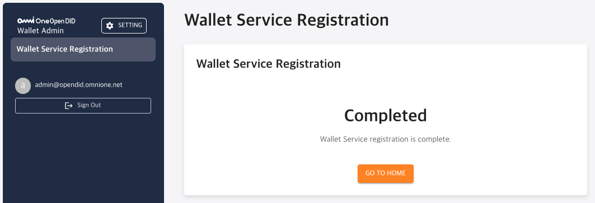
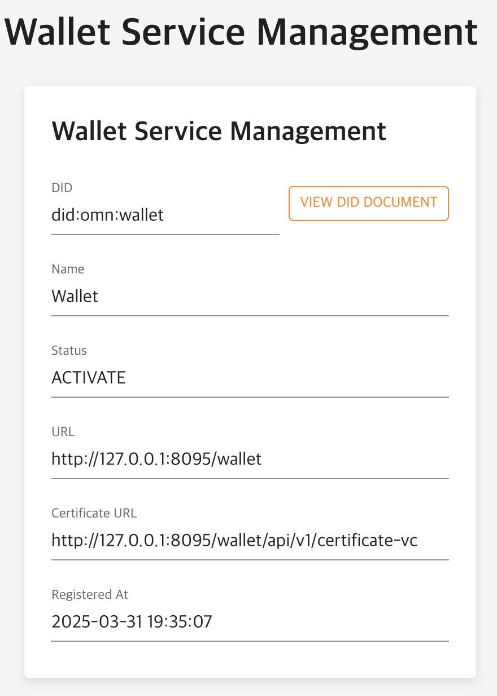

---
puppeteer:
    pdf:
        format: A4
        displayHeaderFooter: true
        landscape: false
        scale: 0.8
        margin:
            top: 1.2cm
            right: 1cm
            bottom: 1cm
            left: 1cm
    image:
        quality: 100
        fullPage: false
---

OpenDID IssuerAdmin Operation Guide
==

- Date: 2025-05-29
- Version: v2.0.0

개정 이력
==
| 버전   | 일자       | 변경 내용 |
| ------ | ---------- | --------- |
| v1.0.0 | 2025-03-31 | 최초 작성 |
| v2.0.0 | 2025-05-29 | 버전 업   |


목차
==

- [OpenDID IssuerAdmin Operation Guide](#opendid-issueradmin-operation-guide)
- [개정 이력](#개정-이력)
- [목차](#목차)
- [1. 소개](#1-소개)
  - [1.1. 개요](#11-개요)
  - [1.2. Admin Console 정의](#12-admin-console-정의)
- [2. 기본 메뉴얼](#2-기본-메뉴얼)
  - [2.1. 로그인](#21-로그인)
  - [2.2. 메인 화면 구성](#22-메인-화면-구성)
  - [2.3. 메뉴 구성](#23-메뉴-구성)
    - [2.3.1. Wallet 미등록 상태](#231-wallet-미등록-상태)
    - [2.3.2. Wallet 등록 상태](#232-wallet-등록-상태)
  - [2.4. 비밀번호 변경 관리](#24-비밀번호-변경-관리)
- [3. 기능별 상세 메뉴얼](#3-기능별-상세-메뉴얼)
  - [3.1. Wallet Service Registration](#31-wallet-service-registration)
    - [▸ Step 1 – Enter Wallet Service Info](#-step-1--enter-wallet-service-info)
    - [▸ Step 2 – Register DID Document](#-step-2--register-did-document)
    - [▸ Step 3 – Register Entity and Issue Certificate VC](#-step-3--register-entity-and-issue-certificate-vc)
    - [▸ 등록 완료 화면](#-등록-완료-화면)
  - [3.2. Wallet Service Management](#32-wallet-service-management)
    - [▸ Wallet Service Manegement](#-wallet-service-manegement)
  - [3.3. User Wallet Management](#33-user-wallet-management)
    - [▸ User Wallet 목록](#-user-wallet-목록)
    - [▸ User Wallet 상세 정보](#-user-wallet-상세-정보)
  - [3.4. Admin Management](#34-admin-management)
    - [▸ Admin 목록 조회](#-admin-목록-조회)
  - [| **Updated At**          | 마지막으로 수정된 일시입니다.](#-updated-at-----------마지막으로-수정된-일시입니다)
    - [▸ Admin 등록](#-admin-등록)
---

# 1. 소개

## 1.1. 개요

본 문서는 Open DID Wallet Admin Console의 설치 및 구동 방법을 안내합니다.
기본 사용법부터 각 기능별 상세 매뉴얼까지 단계적으로 설명하여, 사용자가 콘솔을 효율적으로 활용할 수 있도록 구성되어 있습니다.

OpenDID의 전체 설치에 대한 가이드는 [Open DID Installation Guide]를 참고해 주세요.

## 1.2. Admin Console 정의

**Wallet Admin Console**은 Open DID 시스템 내에서 **Wallet 서버**를 관리하기 위한 웹 기반의 관리자 도구입니다.

Walle은 사용자가 등록한 Wallet 관리 기능을 제공합니다.

Wallet Admin Console에서 설정할 수 있는 주요 항목은 다음과 같습니다:

- **User Wallet 관리**
  - User가 등록한 Wallet 확인

# 2. 기본 메뉴얼

이 장에서는 Open DID Wallet Admin Console의 기본적인 사용 방법에 대해 안내합니다.

## 2.1. 로그인

Wallet Admin Console에 접속하려면 다음 단계를 따르세요:

1. 웹 브라우저를 열고 Wallet Admin Console URL에 접속합니다.

   ```
   http://<wallet_domain>:<port>
   ```

2. 로그인 화면에서 관리자 계정의 이메일과 비밀번호를 입력합니다.
   - 기본 관리자 계정: <admin@opendid.omnione.net>
   - 초기 비밀번호: password (최초 로그인 시 변경 필요)

3. '로그인' 버튼을 클릭합니다.

> **참고**:  
> 보안상의 이유로 최초 로그인 시에는 비밀번호 변경이 필요합니다.

<br/>

## 2.2. 메인 화면 구성

로그인 후 표시되는 메인 화면은 다음과 같은 요소들로 구성되어 있습니다:


| 번호 | 영역             | 설명                                                                                                                                |
| ---- | ---------------- | ----------------------------------------------------------------------------------------------------------------------------------- |
| 1    | 헤더 영역        | 우측 상단의 `SETTING` 버튼을 통해 비밀번호 변경 화면으로 이동할 수 있습니다.                                                        |
| 2    | 콘텐츠 영역      | 현재 선택된 메뉴의 제목과 해당 콘텐츠가 표시됩니다. 각 메뉴에 따라 화면 내용이 바뀝니다.                                            |
| 3    | 사이드 메뉴      | 화면 왼쪽에 위치하며, 주요 메뉴 항목들이 세로로 정렬되어 있습니다. 선택한 메뉴는 강조 표시되며, 필요한 경우 하위 메뉴가 펼쳐집니다. |
| 4    | 사용자 정보 영역 | 현재 로그인한 관리자의 이메일 주소와 '로그아웃(Sign Out)' 버튼이 표시됩니다.                                                        |


<br/>


## 2.3. 메뉴 구성

Wallet Admin Console의 사이드바 메뉴는 **Wallet 등록 상태에 따라 화면 구성에 차이**가 있습니다.


<br/>

### 2.3.1. Wallet 미등록 상태

Wallet 서버가 아직 등록되지 않은 초기 상태에서는
메뉴에 Wallet Service Registration 항목만 단독으로 표시됩니다.


> 참고: Wallet 등록이 완료되면 관련 기능들이 활성화되며, 전체 메뉴가 확장됩니다.
등록 이후 메뉴 구성에 대한 자세한 내용은 추후 항목에서 설명합니다.

### 2.3.2. Wallet 등록 상태

Wallet 등록이 완료되면 전체 관리 기능이 활성화되며, 사이드바 메뉴는 다음과 같이 구성됩니다:


| 번호 | 메뉴 명칭 | Depth | 설명 |
|------|-----------|--------|------|
| 1 | **Wallet Service Management** | 1 | Wallet 서버의 기본 정보(DID, 상태 등)를 확인하고 관리하는 메뉴입니다. |
| 2 | **User Wallet Management** | 1 | User가 등록한 Wallet을 확인하고 관리하는 메뉴입니다. |
| 3 | **Admin Manager** | 1 | Admin Console을 사용하기 위한 계정 관리 메뉴입니다. |

> **참고**:  
> 위 메뉴 구성에 대한 각 기능의 상세 사용법은  
> [3장. 기능별 상세 메뉴얼](#3-기능별-상세-메뉴얼)에서 번호 순서에 따라 설명합니다.
<br/>

## 2.4. 비밀번호 변경 관리

사용자 비밀번호 변경은 다음 단계를 통해 수행할 수 있습니다:

1. 헤더 영역의 'SETTING' 버튼을 클릭합니다.
2. 설정 메뉴에서 '비밀번호 변경'을 선택합니다.
3. 비밀번호 변경 화면에서:
   - 현재 비밀번호 입력
   - 새 비밀번호 입력
   - 새 비밀번호 확인 입력
4. '저장' 버튼을 클릭하여 변경 사항을 적용합니다.

> **참고**: 비밀번호는 8자 이상, 64자 이하의 알파벳 대/소문자, 숫자, 특수문자를 포함해야 합니다.

<br/>

# 3. 기능별 상세 메뉴얼

이 장에서는 Wallet Admin Console의 주요 기능에 대한 상세 사용 방법을 안내합니다.

## 3.1. Wallet Service Registration

Wallet Service Registration은 Wallet Admin Console에서 발급 주체인 **Wallet 서비스**를 등록하는 절차입니다.  
전체 등록은 총 3단계로 구성되며, 각 단계별로 입력, 요청, 승인 과정을 거쳐 등록이 완료됩니다.
모든 단계가 완료되면 Wallet 서비스는 OpenDID 네트워크에 정식 등록됩니다.

<br/>

### ▸ Step 1 – Enter Wallet Service Info


Wallet 서비스의 이름과 서버 URL을 입력하는 단계입니다.

- **Name**: 등록할 Wallet의 이름  
- **Wallet Service URL**: `http://{IP}:8095/wallet` 형식의 서버 엔드포인트  

> **Note**  
> Wallet 서비스 서버와 Admin Console은 동일한 Base URL을 사용하며, 내부적으로 패키지로 분리되어 있습니다.

- 필수 항목 입력 후 **NEXT** 버튼을 클릭합니다.

<br/>

### ▸ Step 2 – Register DID Document

Wallet 서비스의 DID Document를 생성하고, TAS(Trust Agent Service)에 등록 요청 및 승인을 받는 단계입니다. 아래 순서를 따릅니다:

<br/>

**1. Generate DID Document**  
  
`GENERATE` 버튼을 클릭하면 DID 문서가 자동 생성되며, 화면에 JSON 형식으로 출력됩니다.  
> 생성 완료 메시지: ✅ DID Document has been successfully created.
> 
<br/>

**2. Submit Registration Request**  
  
`REQUEST` 버튼 클릭 시 TAS에 DID 문서 등록 요청이 전송됩니다.  
> 요청 완료 메시지: ✅ Registration request has been submitted.


<br/>

**3. Check Approval Status**  
  
`CHECK` 버튼을 클릭하여 TAS 관리자의 승인을 확인합니다.  
> 승인 완료 메시지: ✅ Approval confirmed. You can proceed.

<br/>

**4. 모든 과정을 완료한 화면**  


<br/>

### ▸ Step 3 – Register Entity and Issue Certificate VC


Wallet 서비스를 OpenDID 네트워크의 엔터티로 등록하고, **Certificate VC(신뢰 증명용 VC)**를 발급받는 마지막 단계입니다.

- `REQUEST` 버튼을 클릭하면 TAS를 통해 Entity가 등록됩니다.
- 등록이 완료되면 `FINISH` 버튼을 클릭하여 전체 등록을 마무리합니다

> **참고**  
> Certificate VC는 OpenDID 구성 요소 간의 신뢰 관계를 증명하는 자격 증명입니다.

<br/>

### ▸ 등록 완료 화면

등록이 완료되면 아래와 같은 완료 화면이 표시됩니다.



- "Completed" 메시지가 나타나며, `GO TO HOME` 버튼을 클릭하여 Admin Console 메인 화면으로 이동할 수 있습니다.


## 3.2. Wallet Service Management

Wallet Service Management는 Wallet 서버의 기본 정보를 등록하고 관리하는 메뉴입니다. Wallet은 User Wallet의 관리 주체로서 시스템 내에서 고유한 DID를 가지고 등록되어야 하며, 최초 1회만 등록이 필요합니다.  

Wallet가 등록되면 시스템에 활성 상태(`ACTIVATE`)로 표시되며, 등록 이후에는 등록된 정보를 열람하거나 제한된 범위 내에서 변경할 수 있습니다.

### ▸ Wallet Service Manegement

> **참고**  
현재는 Quick Register 방식의 간편 등록만 지원하며, 정식 등록 절차는 2025년 6월에 업데이트될 예정입니다.

Wallet Service Manegement 화면은 다음 항목들로 구성되어 있습니다.



| 항목              | 설명                                                           |
|-------------------|----------------------------------------------------------------|
| **DID**           | Wallet을 식별하는 고유한 DID로, 시스템에서 자동 발급됩니다.     |
| **Name**          | Wallet의 이름입니다.                                    |
| **Status**        | Wallet을 상태를 나타냅니다. 등록 완료 시 `ACTIVATE`로 표시됩니다. |
| **URL**           | Wallet을 서버의 기본 URL입니다.                                  |
| **Certificate URL** | Wallet의 가입증명서를 확인할 수 있는 URL 주소입니다.          |
| **Registered At** | Wallet의 최초 등록 일시입니다.                                 |

- DID Document는 화면의 `VIEW DID DOCUMENT` 버튼을 통해 확인할 수 있습니다.
- 등록된 Wallet 정보는 삭제가 불가능하며, 일부 항목에 대해 제한된 범위 내에서만 수정이 가능합니다.


## 3.3. User Wallet Management

User Wallet Management는 User가 등록한 Wallet을 확인하고 관리하는 메뉴입니다. 


### ▸ User Wallet 목록

User Wallet 목록 화면에서는 등록된 Wallet들을 확인할 수 있습니다.


| 항목              | 설명                             |
|----------------- |----------------------------------|
| **ID**           | Wallet을 식별하기 위한 고유 식별자입니다. 클릭 시 상세 화면으로 이동합니다. |
| **DID**          | Wallet의 고유 DID입니다. |
| **Registered At**| Wallet이 등록된 일시입니다. |
| **Updated At**   | Wallet이 업데이트된 일시입니다. |


### ▸ User Wallet 상세 정보

User Wallet 목록에서 ID를 클릭하면 상세 정보를 확인할 수 있습니다.


| 항목              | 설명                             |
|----------------- |----------------------------------|
| **ID**           | Wallet을 식별하기 위한 고유 식별자입니다. 클릭 시 상세 화면으로 이동합니다. |
| **DID**          | Wallet의 고유 DID입니다. |
| **Registered At**| Wallet이 등록된 일시입니다. |
| **Updated At**   | Wallet이 업데이트된 일시입니다. |


## 3.4. Admin Management

`Admin Management` 메뉴는 Wallet Admin Console에 접근할 수 있는 관리자 계정을 관리하는 기능입니다.  

TA 서버를 설치하면 기본적으로 `admin@opendid.omnione.net` 계정이 ROOT 권한으로 자동 생성됩니다.  
이 계정은 시스템 내 유일한 ROOT 계정이며, 삭제할 수 없습니다.

관리자 계정은 **ROOT**와 **Normal Admin** 두 가지 권한 유형으로 구분됩니다.  
ROOT 계정은 `Admin Management` 메뉴에서 모든 기능을 수행할 수 있으며, Normal Admin은 일반적인 조회 기능만 가능합니다.

---
> **참고:** 현재는 ROOT 계정과 Normal Admin 계정 간의 권한 차이는  
> `Admin Management` 메뉴에서 표시되는 버튼의 차이(Root만 REGISTER / DELETE / CHANGE PASSWORD 가능) 외에는 없습니다.  
> 그 외 시스템의 다른 메뉴에 대한 접근 권한이나 기능 제한은 아직 적용되어 있지 않습니다.
---


<br/>

### ▸ Admin 목록 조회


`Admin Management` 메뉴에 진입하면 등록된 관리자 계정들의 목록이 테이블 형태로 표시됩니다.


| 항목                    | 설명                                                             |
| ----------------------- | ---------------------------------------------------------------- |
| **ID**                  | 등록된 관리자 계정의 이메일 ID입니다.                              |
| **Role**                | 해당 관리자 계정의 역할(Role)입니다. (예: ROOT, Normal Admin 등)   |
| **Registered At**       | 해당 계정이 최초 등록된 일시입니다.                               |
| **Updated At**          | 마지막으로 수정된 일시입니다.     
---

> `REGISTER 버튼` 클릭시 새로운 관리자 계정을 등록할 수 있는 등록 페이지로 이동합니다.<br/>
> `DELETE 버튼` 클릭시 선택한 관리자 계정을 삭제합니다. (ROOT 관리자만 가능)<br/>
> `CHANGE PASSWORD 버튼` 클릭시 선택한 관리자 계정의 비밀번호를 변경할 수 있습니다.
<br/>

### ▸ Admin 등록

`Admin Management` 화면에서 **REGISTER** 버튼을 클릭하면, 아래와 같은 등록 화면으로 이동합니다.


| 항목                         | 설명                                                                |
| --------------------------- | ------------------------------------------------------------------- |
| **ID**                      | 등록할 관리자 계정의 ID입니다. 이메일 형식을 사용해야 합니다.         |
| **Role**                    | 등록할 관리자 계정의 권한을 선택합니다. (예: Normal Admin)           |
| **Password**                | 로그인 시 사용할 비밀번호를 입력합니다.                              |
| **Re-enter Password**       | 비밀번호를 한 번 더 입력하여 일치 여부를 확인합니다.                |

> `REGISTER 버튼` 클릭시 입력한 정보를 바탕으로 관리자 계정을 등록합니다.<br>
> `RESET 버튼` 클릭시 모든 입력값을 초기화합니다.<br>
> `CANCEL 버튼` 클릭시 등록을 취소하고 이전 화면으로 돌아갑니다.


[Open DID Installation Guide]: https://github.com/OmniOneID/did-release/blob/develop/unrelease-V1.0.1.0/OepnDID_Installation_Guide-V1.0.1.0_ko.md
